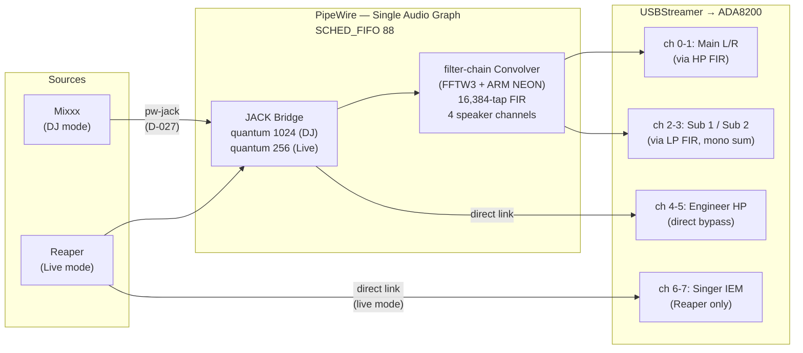
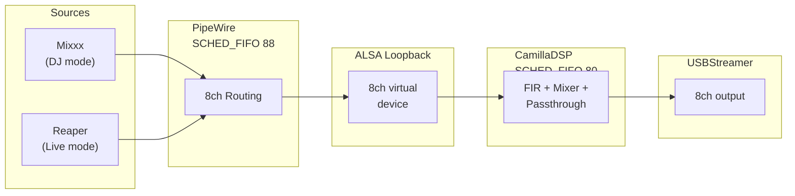

# Real-Time Audio Stack Configuration

This document describes the full real-time (RT) configuration of the Pi 4B
audio workstation. It covers the PREEMPT_RT kernel, thread scheduling
priorities, PipeWire RT configuration, the PipeWire filter-chain convolver,
buffer sizing, and verification procedures.

**Architecture pivot (D-040, 2026-03-16):** The system has migrated from a
dual-graph architecture (PipeWire + CamillaDSP via ALSA Loopback) to a
single-graph architecture where PipeWire's built-in filter-chain convolver
handles all FIR processing natively. CamillaDSP is no longer in the active
signal path. See [GM-12](../lab-notes/GM-12-dj-stability-pw-filter-chain.md)
for the first successful DJ session on the new architecture and
[BM-2](../lab-notes/LN-BM2-pw-filter-chain-benchmark.md) for the benchmark
that triggered the decision.

All configuration files referenced here are version-controlled under
`configs/` in this repository. The ground truth hierarchy for the Pi's
state is: CLAUDE.md > Pi itself > `configs/` directory > `docs/project/`.

**Safety:** All operational safety constraints (transient risk, driver
protection, measurement safety, gain staging) are in
[`docs/operations/safety.md`](../operations/safety.md). This document covers
architecture and configuration only.

---

## Executive Summary

The RT audio stack delivers deterministic, low-latency audio processing on a
Raspberry Pi 4B driving a PA system through 4x450W amplifiers. The design
prioritizes scheduling determinism as a safety requirement (D-013).

### Key Performance Numbers

**Current architecture (PW filter-chain, D-040):**

| Metric | DJ/PA Mode | Live Mode | Evidence |
|--------|-----------|-----------|----------|
| PW convolver CPU (16k taps, 4ch FIR) | 1.70% at quantum 1024 | 3.47% at quantum 256 | [BM-2](../lab-notes/LN-BM2-pw-filter-chain-benchmark.md) |
| PW daemon total CPU (real DJ session) | 41.7% of one core | Not yet tested | [GM-12](../lab-notes/GM-12-dj-stability-pw-filter-chain.md) |
| Estimated PA path (one-way) | ~21ms (1 quantum) | ~5.3ms (1 quantum) | GM-12 theoretical (formal measurement pending) |
| PipeWire quantum | 1024 (21.3ms) | 256 (5.3ms) | D-011 |
| Mixxx CPU (hardware V3D GL) | 25% of one core | N/A | [GM-12](../lab-notes/GM-12-dj-stability-pw-filter-chain.md) |
| System idle (total, 4 cores) | 58.5% | Not yet tested | [GM-12](../lab-notes/GM-12-dj-stability-pw-filter-chain.md) |
| Temperature | 71.1C | Not yet tested | [GM-12](../lab-notes/GM-12-dj-stability-pw-filter-chain.md) |
| Xruns (40+ min DJ session) | 0 (after ALSA buffer fix) | Not yet tested | [GM-12](../lab-notes/GM-12-dj-stability-pw-filter-chain.md) |
| Mixxx at quantum 256 | 175% CPU, ~24 xruns/min | -- | [S-003](../lab-notes/change-S-003-dj-mode-quantum.md) |

**Previous architecture (CamillaDSP via ALSA Loopback, pre-D-040):**

| Metric | DJ/PA Mode | Live Mode | Evidence |
|--------|-----------|-----------|----------|
| CamillaDSP CPU (16k taps, 4ch FIR) | 5.23% at chunksize 2048 | 19.25% at chunksize 256 | [US-001](../lab-notes/US-001-camilladsp-benchmarks.md) T1a, T1c |
| CamillaDSP latency (2 chunks) | 85.3ms | 10.7ms | [US-002](../lab-notes/US-002-latency-measurement.md) T2a, T2b |
| Estimated PA path (one-way) | ~109ms | ~22ms (projected) | [US-002](../lab-notes/US-002-latency-measurement.md) analysis |

The PW filter-chain convolver is 3-5.6x more CPU-efficient than CamillaDSP
at comparable buffer sizes, primarily due to FFTW3's hand-optimized ARM NEON
codelets vs CamillaDSP's rustfft LLVM auto-vectorization. DJ-mode PA path
latency dropped from ~109ms to ~21ms by eliminating the ALSA Loopback bridge
and CamillaDSP's 2-chunk buffering.

### Architecture at a Glance (Current — PW Filter-Chain, D-040)



The entire audio pipeline runs within a single PipeWire graph. No ALSA
Loopback, no external DSP process. The filter-chain convolver uses FFTW3
with ARM NEON SIMD for non-uniform partitioned convolution. Headphone and
IEM channels bypass the convolver via direct PipeWire links.

**Routing topology (GM-12 validated):**
```
Mixxx:out_0 (L)     -> convolver:AUX0 (left HP FIR)     -> USBStreamer:AUX0
Mixxx:out_1 (R)     -> convolver:AUX1 (right HP FIR)    -> USBStreamer:AUX1
Mixxx:out_0 + out_1 -> convolver:AUX2 (sub1 LP FIR)     -> USBStreamer:AUX2
Mixxx:out_0 + out_1 -> convolver:AUX3 (sub2 LP FIR)     -> USBStreamer:AUX3
Mixxx:out_4/out_5   -> USBStreamer:AUX4/AUX5 (headphones, direct bypass)
```

PipeWire natively sums multiple inputs connected to the same port, providing
the L+R mono sum for subwoofer channels without an explicit mixer stage.

### Previous Architecture (Pre-D-040, CamillaDSP via ALSA Loopback)



This architecture was replaced by D-040. CamillaDSP remains installed but its
service is stopped. Historical performance data is preserved in
[US-001](../lab-notes/US-001-camilladsp-benchmarks.md) and
[US-002](../lab-notes/US-002-latency-measurement.md).

---

## 1. PREEMPT_RT Kernel

### Why PREEMPT_RT

The system drives a PA capable of dangerous SPL through 4x450W amplifiers
(D-013). A scheduling delay on a stock PREEMPT kernel has no formal
worst-case bound. If the audio processing thread misses its deadline, the
result is a buffer underrun -- a full-scale transient through the amplifier
chain and a hearing damage risk to anyone near the speakers.

PREEMPT_RT converts the Linux kernel to a fully preemptible architecture
with bounded worst-case scheduling latency. This transforms the system
from "empirically adequate" to "provably adequate" for hard real-time audio
at PA power levels.

**Classification:** Hard real-time with human safety implications (D-013).
See [`docs/operations/safety.md`](../operations/safety.md) Section 6 for the
safety rationale.

### Kernel Version

**Production kernel:** `6.12.62+rpt-rpi-v8-rt`

This is a stock Raspberry Pi OS package from the RPi repos -- no custom
build required. Standard `apt upgrade` delivers updates.

### Boot Configuration

In `/boot/firmware/config.txt`:

```
kernel=kernel8_rt.img
```

This selects the PREEMPT_RT variant of the 64-bit kernel. The stock
PREEMPT kernel remains on the SD card as fallback for development and
benchmarking.

### The V3D Fix (D-022)

Prior to kernel `6.12.62`, PREEMPT_RT and the V3D GPU driver were
incompatible. The V3D driver's `v3d_job_update_stats` function used a
spinlock that was converted to a sleeping `rt_mutex` under PREEMPT_RT.
This created a preemption window that enabled an ABBA deadlock between the
compositor thread and the V3D IRQ handler, manifesting as hard system
lockups within minutes of starting a GPU-intensive application like Mixxx
([F-012, F-017](../lab-notes/F-012-F-017-rt-gpu-lockups.md)).

**Upstream fix:** Commit `09fb2c6f4093` (Melissa Wen / Igalia, merged by
Phil Elwell, 2025-10-28, `raspberrypi/linux#7035`). The fix creates a
dedicated DMA fence lock in the V3D driver, eliminating the problematic
lock ordering.

**Impact:** The fix is included in `6.12.62+rpt-rpi-v8-rt`. With this
kernel, hardware V3D GL works on PREEMPT_RT. No V3D blacklist, no pixman
compositor fallback, no llvmpipe software rendering. Mixxx CPU usage
dropped from 142-166% (llvmpipe) to ~85% (hardware GL)
([F-012/F-017](../lab-notes/F-012-F-017-rt-gpu-lockups.md) Test 1 vs Test 5).

D-022 supersedes D-021's software rendering requirement. The system now
runs a single kernel for both DJ and live modes with hardware GL.

---

## 2. Thread Priority Hierarchy

The RT audio stack uses a strict priority hierarchy enforced via
SCHED_FIFO. Higher priority threads preempt lower priority threads
deterministically. Verified empirically on the Pi
([TK-039-T3d](../lab-notes/TK-039-T3d-dj-stability.md) Phase 0).

```
FIFO/88  PipeWire (graph clock + filter-chain convolver)
FIFO/83  Mixxx audio callback (data-loop.0), pipewire-pulse, WirePlumber
FIFO/50  Kernel IRQ threads
OTHER    Mixxx GUI, PipeWire client threads, system services
BATCH    Mixxx disk I/O
```

| Priority | Scheduler | Process / Thread | Rationale |
|----------|-----------|------------------|-----------|
| 88 | SCHED_FIFO | PipeWire (main) | Audio server drives the graph clock AND runs the filter-chain convolver. Post-D-040, all DSP processing happens inside the PipeWire process at this priority. |
| 83 | SCHED_FIFO | Mixxx audio callback (`data-loop.0`) | PipeWire data loop thread inside Mixxx process. Runs Mixxx's JACK process callback (decode, mix, effects). |
| 83 | SCHED_FIFO | pipewire-pulse, WirePlumber | PipeWire ecosystem threads. WirePlumber provides device management only (D-043): ALSA enumeration, format negotiation, port activation. Linking policies disabled via `90-no-auto-link.conf`. |
| 50 | SCHED_FIFO | IRQ threads | Kernel default on PREEMPT_RT. Hardware interrupt handlers. |
| 0 | SCHED_OTHER | Mixxx GUI, `pw-Mixxx` threads | GUI rendering and PipeWire client housekeeping. Not audio-critical. |
| 0 | SCHED_BATCH | Mixxx disk I/O (`mixxx:disk$0`) | Track loading. Lowest priority (nice 19). |

**Note:** CamillaDSP (previously at SCHED_FIFO/80) is no longer in the active
signal path (D-040). Its systemd service is stopped. The convolver workload
now runs inside the PipeWire process at FIFO/88.

### Mixxx Thread Model

Mixxx is a multi-threaded application. When launched via `pw-jack`, its
threads span multiple scheduling classes:

| TID | Class | Priority | Thread Name | Role |
|-----|-------|----------|-------------|------|
| main | SCHED_OTHER | nice 0 | `mixxx` | Main/GUI thread (Qt event loop, V3D GL rendering) |
| -- | SCHED_BATCH | nice 19 | `mixxx:disk$0` | Disk I/O (track loading, lowest priority) |
| -- | SCHED_OTHER | nice 0 | `pw-Mixxx` | PipeWire client housekeeping (2 threads) |
| -- | **SCHED_FIFO** | **83** | **`data-loop.0`** | **Audio callback (PipeWire data loop)** |

When Mixxx connects to PipeWire via `pw-jack`, PipeWire creates a
`data-loop.0` thread inside the Mixxx process. PipeWire's RT module
elevates this thread to SCHED_FIFO/83. Mixxx's JACK process callback --
audio decode, mixing, and effects processing -- runs inside this FIFO/83
thread. Mixxx does not need `chrt` or any external RT wrapper; PipeWire
handles RT scheduling for the audio path automatically.

The thread name is `data-loop.0`, not `mixxx`. This is why `ps | grep
mixxx` alone does not reveal the RT audio thread -- use `ps -eLo` with
thread-level output to see it.

### Why the Mixxx GUI Must Not Be Elevated

Mixxx's main thread is a Qt GUI loop that performs OpenGL rendering via
the V3D GPU driver. Elevating it to SCHED_FIFO would allow the GUI thread
to hold the CPU while waiting for GPU operations, potentially starving the
audio threads. The GUI thread runs at SCHED_OTHER and is preempted by the
audio stack as needed. This is the correct design: the audio-critical work
runs in the `data-loop.0` thread at FIFO/83, while the GUI runs at normal
priority.

### Quantum 256 Is Not Viable for DJ Mode

Even with FIFO/83 audio threads, quantum 256 is not viable for DJ mode.
Testing showed Mixxx at 175% CPU with ~24 xruns/min at quantum 256
([S-003](../lab-notes/change-S-003-dj-mode-quantum.md)). The
bottleneck is CPU throughput at the 5.3ms callback period, not scheduling
priority -- Mixxx's audio decode and effects processing simply cannot
complete within 5.3ms on the Pi 4B. DJ mode stays at quantum 1024 /
chunksize 2048 (D-011).

---

## 3. PipeWire RT Scheduling

### The Problem (F-020)

PipeWire's RT module (`libspa-rt`) is configured for `rt.prio=88` but
fails to self-promote to SCHED_FIFO on the PREEMPT_RT kernel. It falls
back to `nice=-11` (SCHED_OTHER), causing audible glitches under CPU load.

The root cause is unresolved. Suspected interaction between PipeWire's RT
module initialization and the PREEMPT_RT kernel's different timing/locking
behavior. The RT module works correctly on stock PREEMPT kernels. Manual
promotion via `chrt -f -p 88 <pid>` works, confirming the user has
adequate rlimits (`rtprio 95`).

### The Fix: systemd Drop-In Override

A systemd user service drop-in forces SCHED_FIFO at exec time, before
PipeWire starts. All threads forked by PipeWire inherit SCHED_FIFO from
the main process.

**Config file:** `configs/pipewire/workarounds/f020-pipewire-fifo.conf`
**Deployed to:** `~/.config/systemd/user/pipewire.service.d/override.conf`

```ini
[Service]
CPUSchedulingPolicy=fifo
CPUSchedulingPriority=88
```

This approach was chosen over three alternatives:

| Option | Verdict | Reason |
|--------|---------|--------|
| ExecStartPost with `chrt` | Rejected | Only promotes main PID, not worker threads. Timing-dependent. |
| **systemd CPUSchedulingPolicy** | **Chosen** | Applied at exec time. All forked threads inherit FIFO. Proven pattern. |
| udev rule | Rejected | udev manages devices, not process scheduling. |
| PipeWire config tuning | Rejected | RT module IS loaded and configured correctly; the self-promotion behavior is broken. |

### Deployment

```bash
mkdir -p ~/.config/systemd/user/pipewire.service.d/
cp f020-pipewire-fifo.conf ~/.config/systemd/user/pipewire.service.d/override.conf
systemctl --user daemon-reload
systemctl --user restart pipewire.service
```

### Removal Condition

Remove when PipeWire's RT module self-promotion is fixed upstream for
PREEMPT_RT kernels, or when a PipeWire update resolves the issue.

---

## 4. PipeWire Filter-Chain Convolver (D-040)

Since D-040, all FIR convolution runs inside PipeWire's built-in filter-chain
module. The convolver is loaded via a PipeWire config fragment that defines
the filter topology, coefficient files, and routing.

**Config file (on Pi):**
`~/.config/pipewire/pipewire.conf.d/30-filter-chain-convolver.conf`

The convolver creates two PipeWire nodes:
- **pi4audio-convolver** (`Audio/Sink`): Capture node — receives audio from
  Mixxx/Reaper via PipeWire links
- **pi4audio-convolver-out** (`Audio/Source`): Playback node — sends processed
  audio to USBStreamer

### FIR Coefficient Files

| Channel | File | Filter Type |
|---------|------|-------------|
| Left main (ch 0) | `/etc/pi4audio/coeffs/combined_left_hp.wav` | Highpass FIR (crossover + room correction) |
| Right main (ch 1) | `/etc/pi4audio/coeffs/combined_right_hp.wav` | Highpass FIR (crossover + room correction) |
| Sub 1 (ch 2) | `/etc/pi4audio/coeffs/combined_sub1_lp.wav` | Lowpass FIR (crossover + room correction) |
| Sub 2 (ch 3) | `/etc/pi4audio/coeffs/combined_sub2_lp.wav` | Lowpass FIR (crossover + room correction, phase-inverted for isobaric) |

All filters: 16,384 taps, 48kHz, float32 WAV. Generated by the room
correction pipeline.

### FFT Engine

PipeWire's filter-chain convolver uses **FFTW3** single-precision
(`libfftw3f.so.3`) with hand-optimized ARM NEON codelets for non-uniform
partitioned convolution. Verified on Pi:

```bash
ldd /usr/lib/aarch64-linux-gnu/spa-0.2/filter-graph/libspa-filter-graph.so | grep fft
# Output: libfftw3f.so.3 => /lib/aarch64-linux-gnu/libfftw3f.so.3
```

This is 3-5.6x more CPU-efficient than CamillaDSP's rustfft (LLVM
auto-vectorization) at comparable buffer sizes
([BM-2](../lab-notes/LN-BM2-pw-filter-chain-benchmark.md)).

### CPU Budget (PW Filter-Chain)

| Configuration | CPU % | Measurement | Lab Note |
|---------------|-------|-------------|----------|
| Quantum 1024 (DJ mode) | 1.70% | pidstat (convolver process only) | BM-2 |
| Quantum 256 (live mode) | 3.47% | pidstat (convolver process only) | BM-2 |
| Quantum 1024 (real DJ session) | 41.7% of one core | top (full PW daemon) | GM-12 |
| Convolver B/Q ratio (DJ session) | 8-12% | pw-top | GM-12 |

The BM-2 figures measure the convolver process in isolation with silence
input. The GM-12 figure measures the full PipeWire daemon under real DJ
workload (convolver + graph scheduling + JACK bridge + device I/O). The B/Q
ratio (8-12% of quantum budget) is the convolver-specific metric, consistent
with BM-2.

### Gain Architecture: `linear` Builtin Mult Params (C-009)

PipeWire 1.4.9's filter-chain convolver silently ignores the `config.gain`
parameter in convolver block configs (TK-237). The production gain mechanism
uses four `linear` builtin gain nodes defined in the filter-chain config, each
with a `Mult` parameter on the convolver node (id 43 on production Pi):

| Gain Node | Parameter | Default | Purpose |
|-----------|-----------|---------|---------|
| `gain_left_hp` | `gain_left_hp:Mult` | 0.001 (-60 dB) | Left main attenuation |
| `gain_right_hp` | `gain_right_hp:Mult` | 0.001 (-60 dB) | Right main attenuation |
| `gain_sub1_lp` | `gain_sub1_lp:Mult` | 0.000631 (-64 dB) | Sub 1 attenuation |
| `gain_sub2_lp` | `gain_sub2_lp:Mult` | 0.000631 (-64 dB) | Sub 2 attenuation |

**Key property (C-009):** Mult params persist across PipeWire restarts. Unlike
the earlier `pw-cli volume` workaround (which was runtime-only), Mult values
set via `pw-cli s <node> Props '{ params = [ "<name>:Mult" <value> ] }'` are
stored by PipeWire and restored on restart. No manual reapplication needed.

**Setting gain:**
```bash
# Set left main to -30 dB (Mult = 0.0316):
pw-cli s 43 Props '{ params = [ "gain_left_hp:Mult" 0.0316 ] }'

# Read current gain values:
pw-dump 43 | jq '.[0].info.params.Props[1].params'
# Returns flat key-value array: [ "gain_left_hp:Mult", 0.001, ... ]
```

**Safety cap (D-009):** The Config tab's server-side hard cap enforces
Mult <= 1.0 (0 dB) on every API call. See
[`docs/operations/safety.md`](../operations/safety.md) Section 8 for the
two-layer gain cap architecture.

**Historical note:** The GM-12 session used `pw-cli volume` as a temporary
workaround before the Mult param mechanism was discovered. That approach was
runtime-only and required reapplication after every PipeWire restart.

### Historical: CamillaDSP (Pre-D-040)

CamillaDSP 3.0.1 previously ran as a system service at SCHED_FIFO/80 via
a systemd drop-in override. It processed audio received from PipeWire via
the ALSA Loopback bridge, adding 2 chunks of buffering latency (85.3ms at
chunksize 2048, 10.7ms at chunksize 256). Its service is now stopped.
Historical CPU data is preserved in
[US-001](../lab-notes/US-001-camilladsp-benchmarks.md).

---

## 5. Quantum and Buffer Sizing

The system operates in two modes with different latency/CPU tradeoffs.
Post-D-040, the buffer coordination is simpler: PipeWire quantum is the
single controlling parameter. The convolver processes within the same
graph cycle, adding no additional buffering latency.

### Per-Mode Settings

| Parameter | DJ/PA Mode | Live Mode |
|-----------|-----------|-----------|
| PipeWire quantum | 1024 (21.3ms) | 256 (5.3ms) |
| USBStreamer ALSA period-size | 1024 | 256 |
| USBStreamer ALSA period-num | 3 | 3 |
| USBStreamer ALSA buffer total | 3072 samples (64ms) | 768 samples (16ms) |

All values assume a 48kHz sample rate. Latency values are computed as
samples / sample_rate (e.g., 1024 / 48000 = 21.3ms).

**Critical rule (GM-12 Finding 1):** The USBStreamer ALSA period-size MUST
match the PipeWire quantum. A period-size smaller than the quantum causes
guaranteed underruns every audio cycle. Triple-buffering (period-num=3)
provides margin for scheduling jitter on PREEMPT_RT.

### PipeWire Quantum

The quantum is the number of samples PipeWire processes per graph cycle.
It determines the fundamental scheduling period for the entire audio
pipeline.

**Static config** (`configs/pipewire/10-audio-settings.conf`):

```
context.properties = {
    default.clock.rate          = 48000
    default.clock.quantum       = 256
    default.clock.min-quantum   = 256
    default.clock.max-quantum   = 1024
    default.clock.force-quantum = 256
}
```

The static config sets quantum 256 (live mode default). DJ mode overrides
this at runtime:

```bash
pw-metadata -n settings 0 clock.force-quantum 1024
```

A systemd oneshot service (`configs/systemd/user/pipewire-force-quantum.service`)
runs this command after PipeWire starts to ensure the configured quantum is
applied on boot.

### USBStreamer ALSA Buffer

The USBStreamer is PipeWire's ALSA sink — the final output device. Its ALSA
buffer parameters must be coordinated with the PipeWire quantum.

**Config file (on Pi):**
`~/.config/pipewire/pipewire.conf.d/21-usbstreamer-playback.conf`

For DJ mode (quantum 1024):
```
api.alsa.period-size   = 1024
api.alsa.period-num    = 3
```

Total buffer: 1024 x 3 = 3072 samples (64ms).

**The USBStreamer Buffer Discovery (GM-12 Finding 1):** The original config
had `period-size=256, period-num=2` (buffer=512 samples). This was correct
for live mode (quantum 256) but caused guaranteed underruns in DJ mode
(quantum 1024): the ALSA buffer was smaller than a single quantum. PipeWire
logged `XRun! rate:1024/48000` with USBStreamer ERR count growing ~24/sec.

**Fix:** Updated period-size to match the quantum (1024) and increased
period-num to 3 for scheduling margin. USBStreamer ERR dropped to 0.

**Design rule:** The USBStreamer ALSA period-size MUST match the PipeWire
quantum. When the system switches between DJ mode (quantum 1024) and live
mode (quantum 256), the USBStreamer config must also change. This is an
open item — currently requires manual config update and PipeWire restart.

### Historical: ALSA Loopback Buffer (Pre-D-040)

The ALSA Loopback device previously bridged PipeWire and CamillaDSP. Its
config (`25-loopback-8ch.conf`) has been renamed to `.disabled` on the Pi.
The Loopback buffer sizing lessons (TK-064, F-028) informed the USBStreamer
buffer rule above: ALSA period-size must match the PipeWire quantum to avoid
rebuffering.

### Service Boot Ordering (D-043, US-062)

The audio stack starts in a defined dependency chain managed by systemd
user services. Each service declares its dependencies via `After=` and
`Requires=`/`Wants=` directives.

```
pipewire.service
    |
    +---> wireplumber.service
    |         |
    |         +---> pi4audio-graph-manager.service
    |         |         |
    |         |         +---> mixxx.service (DJ mode)
    |         |         +---> pi4audio-signal-gen.service (measurement mode)
    |         |
    |         +---> pi4audio-dj-routing.service (interim, before GM)
    |
    +---> pipewire-force-quantum.service (oneshot: applies clock.force-quantum)
```

**Boot sequence:**

| Order | Service | Purpose | Wait condition |
|-------|---------|---------|----------------|
| 1 | `pipewire.service` | Audio server, graph clock, filter-chain convolver | Port appears |
| 2 | `wireplumber.service` | Device management: ALSA enumeration, format negotiation, port activation (D-043) | Adapter nodes have ports |
| 3 | `pi4audio-graph-manager.service` | Sole link manager: reconciler creates/destroys links per mode | RPC listening on port 4002 |
| 4 | `mixxx.service` / `pi4audio-signal-gen.service` | Audio application (mode-dependent) | JACK ports registered |

**Key dependencies:**

- **WP must start before GM.** PipeWire ALSA adapter nodes (USBStreamer,
  ada8200-in) require WP to negotiate formats and call `SPA_PARAM_PortConfig`
  before they expose ports. Without WP, adapter nodes exist but have zero
  ports and GM cannot create links (GM-12 Finding 2, D-043).
- **GM must start before Mixxx/signal-gen.** GM must be listening when
  app nodes appear so the reconciler can immediately create the desired
  links and destroy any JACK bypass links.
- **WP linking is disabled.** `90-no-auto-link.conf` ensures WP does not
  create links during the window between WP start and GM start.
- **JACK autoconnect is disabled.** `80-jack-no-autoconnect.conf` prevents
  `pw-jack` applications from calling `jack_connect()` to physical ports
  on activation. GM's reconciler handles any bypass links that still appear.

**Verification:**

```bash
# Check service ordering:
systemctl --user list-dependencies pi4audio-graph-manager.service
# Expected: pipewire.service, wireplumber.service listed as dependencies

# Check boot sequence worked:
systemctl --user status wireplumber pi4audio-graph-manager mixxx
# All three should be active (running)

# Check WP config deployed:
cat ~/.config/wireplumber/wireplumber.conf.d/90-no-auto-link.conf
# Expected: policy.standard = disabled, policy.linking.* = disabled

# Check JACK config deployed:
cat ~/.config/pipewire/jack.conf.d/80-jack-no-autoconnect.conf
# Expected: node.autoconnect = false
```

---

## 6. Signal Path Overview

### Current Signal Path (PW Filter-Chain, D-040)

The complete audio signal path with RT scheduling context:

```
Mixxx (SCHED_OTHER main thread, SCHED_FIFO/83 data-loop.0)
  |
  | pw-jack JACK bridge (via LD_PRELOAD, D-027)
  v
PipeWire (SCHED_FIFO 88) — single audio graph
  |
  | internal PipeWire links (no IPC, no kernel boundary)
  v
filter-chain convolver (runs inside PipeWire process)
  |  - 4x FIR convolution (16,384 taps, FFTW3/NEON)
  |  - ch 0: left HP (crossover + room correction)
  |  - ch 1: right HP (crossover + room correction)
  |  - ch 2: sub1 LP (crossover + room correction, L+R mono sum input)
  |  - ch 3: sub2 LP (crossover + room correction, L+R mono sum, phase-inverted)
  v
USBStreamer hw:USBStreamer,0  (ALSA playback, period-size=1024, period-num=3)
  |
  | USB -> ADAT
  v
ADA8200 (8ch ADAT-to-analog)
  |
  v
Amplifiers (4x450W) -> Speakers / Headphones / IEM

Headphone bypass (ch 4-5):
  Mixxx:out_4/out_5 -> USBStreamer:AUX4/AUX5 (direct PipeWire link, no convolver)

Singer IEM (ch 6-7, live mode only):
  Reaper -> USBStreamer:AUX6/AUX7 (direct PipeWire link, no convolver)
```

Note on `pw-jack` (D-027): Mixxx connects to PipeWire via the `pw-jack`
wrapper, which uses `LD_PRELOAD` to interpose PipeWire's libjack
implementation before the dynamic linker resolves the system
`libjack.so.0` (which points to JACK2). This is the permanent solution --
three sessions (S-005, S-006, S-007) demonstrated that
`update-alternatives` is fundamentally incompatible with `ldconfig` soname
management for shared libraries.

**WirePlumber role (D-043, amends D-039):** WirePlumber is retained for
device-level services only: ALSA device enumeration, format negotiation,
`SPA_PARAM_PortConfig` port activation (pro-audio 8-channel mode for
USBStreamer), and USB hot-plug lifecycle. Its auto-linking policies are
disabled. Three layers prevent bypass links:

1. **WP linking disabled:** `90-no-auto-link.conf` disables `policy.standard`,
   `policy.linking.standard`, and `policy.linking.role-based` profiles.
2. **JACK autoconnect disabled:** `80-jack-no-autoconnect.conf` sets
   `node.autoconnect = false` for all JACK clients, suppressing the PW
   stream `AUTOCONNECT` flag.
3. **GraphManager reconciler cleanup:** GM's Phase 2 reconciliation
   actively destroys links not in the desired set for the current mode.
   This handles JACK client `jack_connect()` bypass links that cannot be
   suppressed at the source (they originate inside PW's `libjack-pw.so`).

This architecture resolves GM-12 Findings 2 and 11. WP provides device
management; GraphManager is the sole link manager.

### Latency Budget

**Current architecture (PW filter-chain, D-040):**

| Segment | DJ Mode (quantum 1024) | Live Mode (quantum 256) |
|---------|------------------------|-------------------------|
| PipeWire graph (1 quantum) | ~21.3ms | ~5.3ms |
| Filter-chain convolver | ~0ms (synchronous, within same graph cycle) | ~0ms |
| USB + ADAT | ~1ms | ~1ms |
| **Estimated PA path** | **~21ms** | **~5.3ms** |

**Previous architecture (CamillaDSP via ALSA Loopback, pre-D-040):**

| Segment | DJ Mode (chunksize 2048) | Live Mode (chunksize 256) |
|---------|-------------------------|---------------------------|
| PipeWire output adapter | ~21.3ms | ~5.3ms |
| ALSA Loopback | <1ms | <1ms |
| CamillaDSP (2 chunks) | ~85.3ms | ~10.7ms |
| USB + ADAT | ~1ms | ~1ms |
| **Estimated PA path** | **~109ms** | **~22ms** |

The DJ-mode latency improvement is ~5x (109ms -> 21ms). The ALSA Loopback
bridge and CamillaDSP's 2-chunk buffering — both eliminated by D-040 —
accounted for ~88ms of the original signal path.

**Note:** The ~21ms DJ-mode figure is theoretical (1 quantum). A formal
loopback measurement (like US-002) has not yet been performed on the
PW filter-chain architecture. The live-mode ~5.3ms figure is
transformative for singer slapback prevention — the original D-011
motivation targeted ~22ms at chunksize 256, and the new architecture
achieves ~5.3ms.

---

## 7. Verification Commands

Run these on the Pi to verify the RT audio stack is correctly configured.

### Kernel

```bash
# Check running kernel:
uname -r
# Expected: 6.12.62+rpt-rpi-v8-rt (or later RT kernel)

# Confirm PREEMPT_RT:
uname -v | grep -o 'PREEMPT_RT'
# Expected: PREEMPT_RT

# Check config.txt:
grep '^kernel=' /boot/firmware/config.txt
# Expected: kernel=kernel8_rt.img
```

### PipeWire Scheduling

```bash
# Check PipeWire scheduling policy:
chrt -p $(pgrep -x pipewire)
# Expected:
#   current scheduling policy: SCHED_FIFO
#   current scheduling priority: 88

# Check all PipeWire threads:
ps -eo pid,cls,rtprio,ni,comm | grep pipewire
# Expected: FF (FIFO) in CLS column, 88 in RTPRIO column

# Check the systemd override is in place:
systemctl --user cat pipewire.service | grep -A2 CPUScheduling
# Expected:
#   CPUSchedulingPolicy=fifo
#   CPUSchedulingPriority=88
```

### PipeWire Filter-Chain Convolver

```bash
# Check convolver nodes exist:
pw-cli ls Node | grep pi4audio-convolver
# Expected: two nodes:
#   pi4audio-convolver (Audio/Sink — capture side)
#   pi4audio-convolver-out (Audio/Source — playback side)

# Check convolver B/Q ratio (busy/quantum):
pw-top
# Look for the convolver node. B/Q should be 0.08-0.12 (8-12% of quantum)

# Check FFT engine:
ldd /usr/lib/aarch64-linux-gnu/spa-0.2/filter-graph/libspa-filter-graph.so | grep fft
# Expected: libfftw3f.so.3

# Check convolver gain (Mult params, C-009):
pw-dump 43 | jq '.[0].info.params.Props[1].params'
# Expected: flat array with gain_left_hp:Mult, gain_right_hp:Mult, etc.
# Values should be <= 1.0 (D-009 hard cap). Production defaults: 0.001 mains, 0.000631 subs.

# Verify FIR coefficient files exist:
ls -la /etc/pi4audio/coeffs/combined_*.wav
# Expected: 4 files (left_hp, right_hp, sub1_lp, sub2_lp)
```

### CamillaDSP (Historical — Pre-D-040)

```bash
# CamillaDSP service should be stopped:
systemctl is-active camilladsp.service
# Expected: inactive
```

### PipeWire Quantum

```bash
# Check current quantum:
pw-metadata -n settings | grep clock.force-quantum
# Expected (DJ mode): clock.force-quantum = 1024
# Expected (live mode): clock.force-quantum = 256

# Check actual graph timing:
pw-top
# Look at the "QUANT" column -- should show 1024 (DJ) or 256 (live)
```

### USBStreamer ALSA Buffer

```bash
# Check USBStreamer device exists:
aplay -l | grep USBStreamer
# Expected: card N: USBStreamer [USBStreamer], device 0: ...

# Check USBStreamer ALSA hw_params (while audio is flowing):
cat /proc/asound/USBStreamer/pcm0p/sub0/hw_params
# Expected (DJ mode):
#   period_size: 1024
#   buffer_size: 3072
#   rate: 48000

# Check PipeWire USBStreamer config:
cat ~/.config/pipewire/pipewire.conf.d/21-usbstreamer-playback.conf | grep period
# Expected (DJ mode):
#   api.alsa.period-size   = 1024
#   api.alsa.period-num    = 3

# Check USBStreamer ERR count (should be 0):
pw-top
# Look at the USBStreamer node ERR column
```

### Audio Link Topology

```bash
# Show all active PipeWire links:
pw-link -l
# Expected links (DJ mode):
#   Mixxx:out_0 -> pi4audio-convolver:AUX0
#   Mixxx:out_1 -> pi4audio-convolver:AUX1
#   Mixxx:out_0 -> pi4audio-convolver:AUX2 (mono sum L)
#   Mixxx:out_1 -> pi4audio-convolver:AUX2 (mono sum L)
#   Mixxx:out_0 -> pi4audio-convolver:AUX3 (mono sum R)
#   Mixxx:out_1 -> pi4audio-convolver:AUX3 (mono sum R)
#   pi4audio-convolver-out:AUX0-3 -> USBStreamer:AUX0-3
#   Mixxx:out_4/out_5 -> USBStreamer:AUX4/AUX5 (headphone bypass)

# Check for unwanted bypass links (should NOT exist):
pw-link -l | grep -E "Mixxx.*USBStreamer.*AUX[0-3]"
# Expected: empty (no direct Mixxx->USBStreamer links on speaker channels)
# D-043: three layers prevent these (WP linking disabled, JACK autoconnect
# disabled, GM reconciler cleanup). If present despite this, check that
# 90-no-auto-link.conf and 80-jack-no-autoconnect.conf are deployed.
```

### Full Priority Check

```bash
# Show all SCHED_FIFO processes:
ps -eo pid,cls,rtprio,ni,comm | grep FF
# Expected to see at minimum:
#   pipewire       FF  88
#   pipewire-pulse FF  83
# CamillaDSP should NOT appear (service stopped per D-040)

# Confirm Mixxx GUI thread is NOT FIFO:
ps -eo pid,cls,rtprio,ni,comm | grep -i mixxx
# Expected: TS (timeshare/SCHED_OTHER), no RTPRIO value
```

### Mixxx Thread-Level Check

The Mixxx audio thread is named `data-loop.0`, not `mixxx`. Use
thread-level output to see it:

```bash
# Show all threads in the Mixxx process:
ps -eLo pid,tid,cls,rtprio,ni,comm -p $(pgrep -x mixxx)
# Expected:
#   mixxx        TS   -   0   mixxx           (GUI, SCHED_OTHER)
#   mixxx:disk$0 BT   -  19   mixxx           (disk I/O, SCHED_BATCH)
#   pw-Mixxx     TS   -   0   mixxx           (PipeWire housekeeping x2)
#   data-loop.0  FF  83   -   mixxx           (audio callback, SCHED_FIFO)

# Or check just the FIFO thread:
ps -eLo pid,tid,cls,rtprio,comm -p $(pgrep -x mixxx) | grep FF
# Expected: data-loop.0 at FF/83
```

---

## References

### Decisions and Defects

| ID | Document | Relevance |
|----|----------|-----------|
| D-039 | `docs/project/decisions.md` | GraphManager is sole session manager (no WP for linking) |
| D-040 | `docs/project/decisions.md` | Abandon CamillaDSP — pure PipeWire filter-chain pipeline |
| D-043 | `docs/project/decisions.md` | Amend D-039 — WirePlumber retained for device management, linking disabled |
| D-011 | `docs/project/decisions.md` | Live mode quantum 256 (latency target) |
| D-013 | `docs/project/decisions.md` | PREEMPT_RT mandatory for production |
| D-022 | `docs/project/decisions.md` | V3D fix, hardware GL on PREEMPT_RT |
| D-027 | `docs/project/decisions.md` | pw-jack permanent solution |
| F-020 | `docs/project/defects.md` | PipeWire RT self-promotion failure |

### Configuration Files

| File | Location | Purpose |
|------|----------|---------|
| `f020-pipewire-fifo.conf` | `configs/pipewire/workarounds/` | PipeWire FIFO override |
| `10-audio-settings.conf` | `configs/pipewire/` | PipeWire quantum settings |
| `30-filter-chain-convolver.conf` | On Pi: `~/.config/pipewire/pipewire.conf.d/` | PW filter-chain convolver config |
| `21-usbstreamer-playback.conf` | On Pi: `~/.config/pipewire/pipewire.conf.d/` | USBStreamer ALSA buffer config |
| `80-jack-no-autoconnect.conf` | On Pi: `~/.config/pipewire/jack.conf.d/` | Disable JACK client autoconnect (D-043) |
| `90-no-auto-link.conf` | On Pi: `~/.config/wireplumber/wireplumber.conf.d/` | Disable WP linking policies (D-043) |
| `combined_*.wav` | On Pi: `/etc/pi4audio/coeffs/` | FIR coefficient files (4 channels) |

### Lab Notes (evidence for quoted numbers)

| Lab Note | Key Numbers |
|----------|-------------|
| [BM-2](../lab-notes/LN-BM2-pw-filter-chain-benchmark.md) | PW convolver CPU: 1.70% (q1024), 3.47% (q256). FFTW3 NEON 3-5.6x faster than CamillaDSP. |
| [GM-12](../lab-notes/GM-12-dj-stability-pw-filter-chain.md) | First PW-native DJ session: 0 xruns, 58.5% idle, 71C. 11 findings. |
| [US-001](../lab-notes/US-001-camilladsp-benchmarks.md) | Historical CamillaDSP CPU: 5.23% (cs2048), 10.42% (cs512), 19.25% (cs256) |
| [US-002](../lab-notes/US-002-latency-measurement.md) | Historical latency: 139ms (cs2048), 80.8ms (cs512). CamillaDSP = 2 chunks. |
| [F-012/F-017](../lab-notes/F-012-F-017-rt-gpu-lockups.md) | Mixxx CPU: 142-166% (llvmpipe), ~40% (hardware GL + CamillaDSP era) |
| [S-003](../lab-notes/change-S-003-dj-mode-quantum.md) | Quantum 256 not viable for DJ: 175% CPU, ~24 xruns/min |

### Safety

All safety constraints are in [`docs/operations/safety.md`](../operations/safety.md).

**Gain architecture (C-009):** PipeWire 1.4.9's filter-chain convolver
silently ignores `config.gain`. The production gain mechanism uses `linear`
builtin Mult params on the convolver node (Section 4). These persist across
PipeWire restarts — no manual reapplication needed. The Config tab (US-065)
enforces a server-side hard cap of Mult <= 1.0 (0 dB) per D-009.
